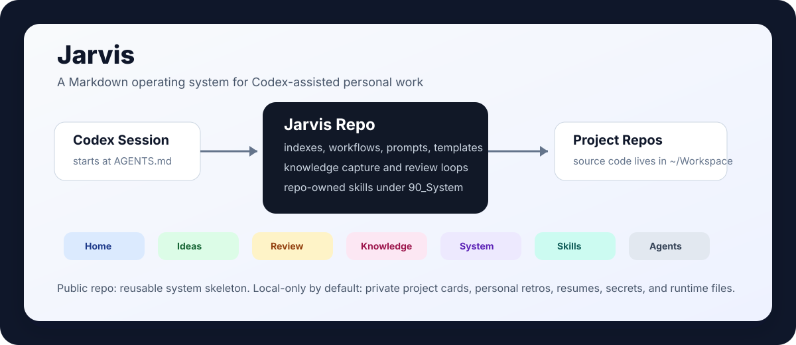

# Jarvis

Jarvis is a Markdown-based operating system for personal work with Codex: project routing, idea capture, workflows, agents, templates, skills, knowledge capture, and review loops.

It is built for people who want their AI-assisted work to have memory, boundaries, and repeatable paths without turning every note into application source code.



Languages: [English](README.md) | [简体中文](READMEs/README.zh-CN.md)

[](LICENSE)
[](#quick-start)
[](#using-with-codex)

## Contents

- [Why Jarvis Exists](#why-jarvis-exists)
- [What You Get](#what-you-get)
- [Quick Start](#quick-start)
- [Using With Codex](#using-with-codex)
- [Project Structure](#project-structure)
- [Public And Local Boundaries](#public-and-local-boundaries)
- [Skills, Workflows, And Agents](#skills-workflows-and-agents)
- [Useful Commands](#useful-commands)
- [Publishing Checklist](#publishing-checklist)
- [License](#license)

## Why Jarvis Exists

When an AI coding session starts in the wrong place, it can blur project code, planning notes, reusable knowledge, private records, and one-off ideas. Jarvis gives that work a stable map.

The core idea is simple: keep the personal work system in Jarvis, keep real source code in separate project repositories, and let `AGENTS.md` plus the `90_System/` layer route each session into the right workflow.

## What You Get

### A Reusable Work-System Skeleton

Jarvis ships with the standard layers for home dashboards, project indexes, ideas, knowledge, reviews, career assets, and system rules.

### Codex Session Routing

The top-level `AGENTS.md` tells Codex where to look first, when to enter a real project repo, when to classify an idea, and when to preserve knowledge only after confirmation.

### Workflow And Agent Registries

`90_System/` contains reusable workflows, agent registries, prompts, templates, rules, and tools so the system can evolve without scattering instructions across random notes.

### Repo-Owned Skills

Custom skills live under `90_System/Skills/` and can be linked into `~/.agents/skills` by the installer.

### Privacy By Default

The repo is designed to publish the reusable system while keeping real project cards, personal retros, resumes, interview notes, caches, and local runtime files out of Git by default.

## Quick Start

### 1. Clone

```bash
git clone https://github.com/RockyYang1225/Jarvis.git Jarvis
cd Jarvis
```

### 2. Install Local Support

```bash
./scripts/install.sh
```

The installer is idempotent. It creates standard directories, preserves local files, adds `.gitkeep` placeholders, and links repo-owned skills into `~/.agents/skills`.

### 3. Verify

```bash
./scripts/public-readiness-scan.sh
```

Then open Codex from the Jarvis repo root so `AGENTS.md` is loaded first.

## Using With Codex

Start Codex from the Jarvis root. The top-level `AGENTS.md` tells Codex how to route work:

- project code belongs in `~/Workspace/<repo>`
- Jarvis stores thinking, indexing, reusable knowledge, workflows, prompts, templates, and skills
- long-term knowledge writes should be confirmed before they are committed
- user-facing Jarvis notes are Chinese by default
- agent prompts and execution rules may be English when that makes execution clearer

For project code, enter the actual repo and read that repo's `AGENTS.md`, `agents/README.md`, and `docs/project-home.md`.

## Project Structure

```text
00_Home/        Dashboard, current focus, operating guide
10_Workspace/   Project indexes and project cards, not source code
20_Career/      Resume, interview, and portfolio assets
30_Ideas/       Idea inbox, briefs, categories, incubation
40_Knowledge/   Stable reusable knowledge indexes and notes
50_Reviews/     Daily, weekly, monthly, project, and interview reviews
90_System/      Jarvis rules, templates, agents, workflows, prompts, skills
docs/           Design docs, implementation plans, and project notes
scripts/        Installers, checks, and maintenance helpers
```

Real application source code should live outside Jarvis, usually under:

```text
~/Workspace/<repo>
```

## Public And Local Boundaries

Good candidates for Git:

- `AGENTS.md`
- `README.md`
- `00_Home/` generic operating guides
- `30_Ideas/` category and workflow indexes
- `90_System/` agents, workflows, templates, prompts, rules, tools, and skills
- top-level layer index files
- sanitized examples and templates

Keep local by default:

- real active project cards
- resumes and interview notes
- private knowledge notes
- daily, weekly, monthly, and project retros
- secrets, tokens, local automation state, exports, caches, and logs

The `.gitignore` is intentionally conservative. If a private section needs a public example, add a sanitized example or template instead of committing the real note.

## Skills, Workflows, And Agents

### Add A Skill

Put repo-owned skills under:

```text
90_System/Skills/<skill-name>/SKILL.md
```

Run:

```bash
./scripts/install.sh
```

The installer links each skill into:

```text
~/.agents/skills/<skill-name>
```

### Add A Workflow, Agent, Or Template

Use the system folders:

- `90_System/Workflows/`
- `90_System/Agents/`
- `90_System/Templates/`
- `90_System/Prompts/`
- `90_System/Rules/`
- `90_System/Tools/`

Update the corresponding registry or index when adding a new reusable capability.

## Useful Commands

| Task | Command |
|---|---|
| Install or refresh local skill links | `./scripts/install.sh` |
| Scan public files before publishing | `./scripts/public-readiness-scan.sh` |
| Check README links | `rtk python3 90_System/Skills/project-readme-builder/scripts/check_readme_links.py . README.md` |
| Inspect Git status | `git status --short` |

## Publishing Checklist

Before making changes public:

```bash
./scripts/public-readiness-scan.sh
git status --short
```

Review the changed and tracked file list. Do not publish private project cards, resumes, interview notes, secrets, or personal retros unless they have been intentionally sanitized.

## Project Status

Jarvis is an active personal work-system template. It is useful today as a Markdown/Codex workspace, but individual users should adapt workflows, templates, prompts, and privacy rules to their own operating style.

## License

MIT License. See [LICENSE](LICENSE).
